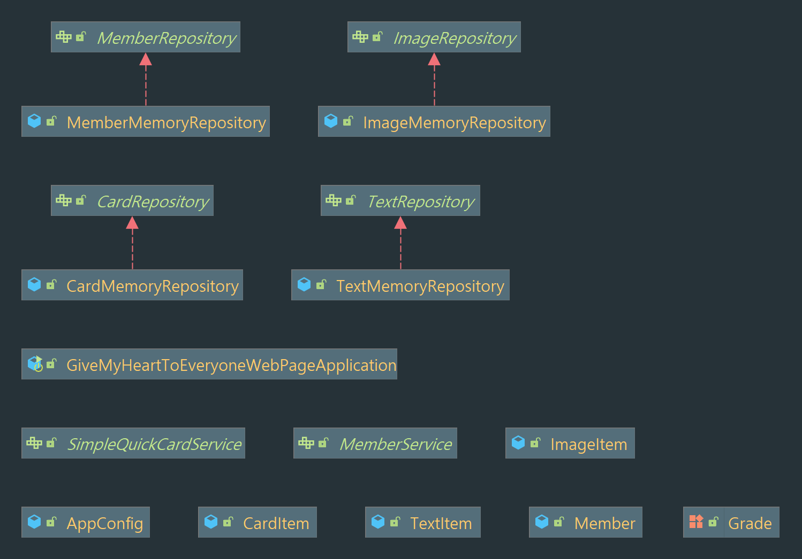

# GiveMyHeartToEveryonePageServer
Give heart to everyone page server


## 2021-12-18
생성하고 삭제하기를 수도 없이 반복했다. 조금 더 객체 지향적인 설계를 하기 위해 나는 새로 만들었던 코드들을 다 삭제하고 새로 만들었다.
이렇게 시간을 많이 할애하면서 이제서야 스프링의 장점이 보였다. 스프링과 자바는 내가 언제들 구현 객체들을 변경하고 테스트 할 수 있도록
큰 도움이 됐다. 오늘까지 Repository 인터페이스를 이용해 구현체를 만들어 테스트까지 해봤다. 

다음주 부터는 서비스를 만들어 특정한 상황이 왔을 때, 어떻게 실행해야 하는지 테스트 할 생각이다.

### work flow

[깃 관리](https://techblog.woowahan.com/2553/)

### Show Diagram


### 현재까지 등록한 Bean 테스트 
<details> 
<summary>AppConfig</summary> 

```java
/**
 * Created by Imaspear on 2021-12-18
 * Blog : https://imspear.tistory.com/
 * Github : https://github.com/Imaspear
 */
class AppConfigTest {
    AnnotationConfigApplicationContext applicationContext = new AnnotationConfigApplicationContext(AppConfig.class);

    @Test
    @DisplayName("카드 저장소, 이름으로 조회")
    public void findCardRepositoryBeanByName() throws Exception{
        //then
        CardRepository cardRepository = applicationContext.getBean("cardRepository", CardRepository.class);
        //when
        assertThat(cardRepository).isInstanceOf(CardMemoryRepository.class);
    }

    @Test
    @DisplayName("이미지 저장소, 빈 이름으로 조회")
    public void findImageRepositoryBeanByName() throws Exception{
        //then
        ImageRepository imageRepository = applicationContext.getBean("imageRepository", ImageRepository.class);
        //when
        assertThat(imageRepository).isInstanceOf(ImageMemoryRepository.class);
    }

    @Test
    @DisplayName("텍스트 저장소, 빈 이름으로 조회")
    public void findTextRepositoryBeanByName() throws Exception{
        //then
        TextRepository textRepository = applicationContext.getBean("textRepository", TextRepository.class);
        //when
        assertThat(textRepository).isInstanceOf(TextMemoryRepository.class);
    }

    @Test
    @DisplayName("멤버 저장소, 빈 이름으로 조회")
    public void findMemberRepositoryBeanByName() throws Exception{
        //then
        MemberRepository memberRepository = applicationContext.getBean("memberRepository", MemberRepository.class);
        //when
        assertThat(memberRepository).isInstanceOf(MemberMemoryRepository.class);
    }
}
```
</details> 

### Repository test code 추가

<details> 
<summary>CardMemoryRepositoryTest</summary> 

```java
/**
 * Created by Imaspear on 2021-12-18
 * Blog : https://imspear.tistory.com/
 * Github : https://github.com/Imaspear
 */
class CardMemoryRepositoryTest {
    
    Map<Long, CardItem> cardItemMap = new HashMap<>();
    Long sequence = 0L;
    Member imaspear = new Member(sequence, "imaspear", Grade.VIP);
    Member imnotaspear = new Member(++sequence, "imnotaspear",Grade.Basic);
    
    @BeforeEach
    void setUp() {
//      기존 저장되어 있는 객체들이라 가정
        for (int i = 0; i < 20; i++) {
            CardItem itemOfImaspear = new CardItem(++sequence, "hihi" + i, imaspear.getMemberId());
            CardItem itemOfImnotaspear = new CardItem(++sequence, "youdo" + i, imnotaspear.getMemberId());

            cardItemMap.put(itemOfImaspear.getCardId(), itemOfImaspear);
            cardItemMap.put(itemOfImnotaspear.getCardId(), itemOfImnotaspear);
        }
    }

    @Test
    @DisplayName("카드 하나 조회하기 위해 카드 ID를 이용해 데이터 가져오기")
    void getOneByCardId() {
        for (Long i = 5L; i < 20L; i++) {
            System.out.println(cardItemMap.get(i));
            Assertions.assertThat(cardItemMap.get(i)).isNotNull();
        }
    }

    @Test
    @DisplayName("추가로 데이터들을 저장하기")
    void saveOneByCardId() {
        for (int i = 0; i < 20; i++) {
            CardItem itemOfImaspear = new CardItem(++sequence, "hihi" + i, imaspear.getMemberId());
            CardItem itemOfImnotaspear = new CardItem(++sequence, "youdo" + i, imnotaspear.getMemberId());
            cardItemMap.put(itemOfImaspear.getCardId(), itemOfImaspear);
            cardItemMap.put(itemOfImnotaspear.getCardId(), itemOfImnotaspear);
        }
        Assertions.assertThat(cardItemMap.size()).isEqualTo(80);
    }

    @Test
    @DisplayName("카드 하나 삭제하기")
    void deleteOneByCardId() {
        if(!cardItemMap.isEmpty()){
            cardItemMap.remove(5L);
        }
        Assertions.assertThat(cardItemMap.get(5L)).isNull();
    }
}
```
</details>

<details> 
<summary>ImageMemoryRepositoryTest</summary> 

```java
/**
 * Created by Imaspear on 2021-12-18
 * Blog : https://imspear.tistory.com/
 * Github : https://github.com/Imaspear
 */
class ImageMemoryRepositoryTest {

    Map<Long, Map<Long, ImageItem>> saveImageItemsByCardId;
    Long sequence = 0L;
    Member member = new Member(sequence, "imaspear", Grade.VIP);
    CardItem testCard = new CardItem(++sequence, "testCard", member.getMemberId());

    @BeforeEach
    void set(){
        saveImageItemsByCardId = new HashMap<>();
    }

    @Test
    @DisplayName("임의의 이미지 아이템을 생성해 저장")
    void saveTextItemsByCardId() {
        //given
        Map<Long, ImageItem> imageItems = new HashMap<>();

        for (int i = 0; i < 10; i++) {
            ImageItem imageItem = new ImageItem(++sequence, "/path/number");
            imageItems.put(imageItem.getImageId(), imageItem);
        }
        Long testCardId = testCard.getCardId();
        //when
        saveImageItemsByCardId.put(testCard.getCardId(), imageItems);
        //then
        assertThat(imageItems).isEqualTo(saveImageItemsByCardId.get(testCardId));
    }


    @Test
    @DisplayName("임의의 이미지 아이템을 가져오기")
    void getTextItemsByCardId() {
        //given
        saveTextItemsByCardId();
        Long testCardId = testCard.getCardId();
        //when
        //then
        for(Long key: saveImageItemsByCardId.get(testCardId).keySet()){
            System.out.println(saveImageItemsByCardId.get(testCardId).get(key).toString());
        }
    }

    @Test
    @DisplayName("하나의 카드 아이디를 가져와 수정하기")
    void editTextItems() {
        //given
        saveTextItemsByCardId();
        Long cardId = this.testCard.getCardId();
//      깊은 복사를 직접 해줘 판별하자
        Map<Long, ImageItem> imageItemMap = new HashMap<>();
        for (Long key : saveImageItemsByCardId.get(cardId).keySet()) {
            ImageItem textItem = new ImageItem(this.saveImageItemsByCardId.get(cardId).get(key).getImageId(), saveImageItemsByCardId.get(cardId).get(key).getPath() + "/new");
            imageItemMap.put(textItem.getImageId(), textItem);
        }
        //when
        ImageItem imageItem = new ImageItem(++sequence, "/path/new");
        imageItemMap.put(imageItem.getImageId(), imageItem);
        saveImageItemsByCardId.replace(testCard.getCardId(), imageItemMap);
        //then
//      imageItems을 전역변수로 설정하고, 이 메서드에서 전역 변수를 호출해서 사용하면 깊은 복사가 이뤄질 수 밖에 없다.
//      textItemMap과 textItems은 같은 객체이다. 하나를 변경하면 바뀐다.
//        textItemMap.clear();
//        assertThat(textItems).isEmpty();
//        assertThat(saveImageItemsByCardId.get(testCard.getCardId()))
    }

    @Test
    @DisplayName("삭제하는 테스트")
    void deleteTextItemsByCardId() {
        //given
        saveTextItemsByCardId();
        Long cardId = this.testCard.getCardId();
        //when
        saveImageItemsByCardId.remove(cardId);
        //then
        assertThat(saveImageItemsByCardId.get(cardId)).isNull();
    }

}
```
</details>

<details> 
<summary>TextMemoryRepositoryTest</summary> 

```java
/**
 * Created by Imaspear on 2021-12-18
 * Blog : https://imspear.tistory.com/
 * Github : https://github.com/Imaspear
 */
class TextMemoryRepositoryTest {
    Map<Long, Map<Long, TextItem>> saveTextItemsByCardId;
    Long sequence = 0L;
    Member member = new Member(sequence, "imaspear", Grade.VIP);
    CardItem testCard = new CardItem(++sequence, "testCard", member.getMemberId());
    @BeforeEach
    void set(){
        saveTextItemsByCardId = new HashMap<>();
    }

    @Test
    @DisplayName("임의의 텍스트 아이템을 생성해 저장")
    void saveTextItemsByCardId() {
        //given
        Map<Long, TextItem> textItems = new HashMap<>();
        for (int i = 0; i < 10; i++) {
            TextItem textItem = new TextItem(++sequence, "/path/number");
            textItems.put(textItem.getTextId(), textItem);
        }
        //when
        saveTextItemsByCardId.put(testCard.getCardId(), textItems);
        //then
        assertThat(textItems).isEqualTo(saveTextItemsByCardId.get(testCard.getCardId()));
    }


    @Test
    @DisplayName("cardId를 이용해 카드의 텍스트 정보 가져오기")
    void getTextItemsByCardId() {
        //given
        saveTextItemsByCardId();
        //when
        Long testCardId = testCard.getCardId();
        //then
        for(Long key: saveTextItemsByCardId.get(testCardId).keySet()){
            assertThat(saveTextItemsByCardId.get(testCardId).get(key).getPath()).isNotEmpty();
        }
    }

    @Test
    @DisplayName("해당 카드의 텍스트 변경하기")
    void editTextItems() {
        saveTextItemsByCardId();
//      깊은 복사를 직접 해줘 판별하자
        Map<Long, TextItem> textItemMap = new HashMap<>();
        for (Long key : saveTextItemsByCardId.get(testCard.getCardId()).keySet()) {
            TextItem textItem = new TextItem(saveTextItemsByCardId.get(testCard.getCardId()).get(key).getTextId(), saveTextItemsByCardId.get(testCard.getCardId()).get(key).getPath() + "/new");
            textItemMap.put(textItem.getTextId(), textItem);
        }
        TextItem textItem = new TextItem(++sequence, "/path/new");
        textItemMap.put(textItem.getTextId(), textItem);
        saveTextItemsByCardId.replace(testCard.getCardId(), textItemMap);

//      textItemMap과 textItems은 같은 객체이다. 하나를 변경하면 바뀐다.
//        textItemMap.clear();
//        assertThat(textItems).isEmpty();
    }

    @Test
    @DisplayName("해당 카드의 텍스트 삭제하기")
    void deleteTextItemsByCardId() {
        //given
        saveTextItemsByCardId();
        Long cardId = this.testCard.getCardId();
        //when
        saveTextItemsByCardId.remove(cardId);
        //then
        assertThat(saveTextItemsByCardId.get(cardId)).isNull();
    }
}
```
</details>


#### member
<details>
<summary>MemberMemoryRepositoryTest</summary>

### 추후 업데이트
```java
```
</details>

## 2021-12-27 ~ 2021-12-29
### 해야할 일
1. 카드 서비스를 분리해 이미지 저장하는 서비스와 텍스트 저장하는 서비스로 분리하자 
2. 각 서비스들을 테스트하자
3. 새로운 이미지리스트와 텍스트리트스 정보를 담는 객체를 생성할지 고민하자
4. HashMap 클래스로 구현된 메모리 저장소들을 ConcurrentHashMap 클래스로 구현하자

